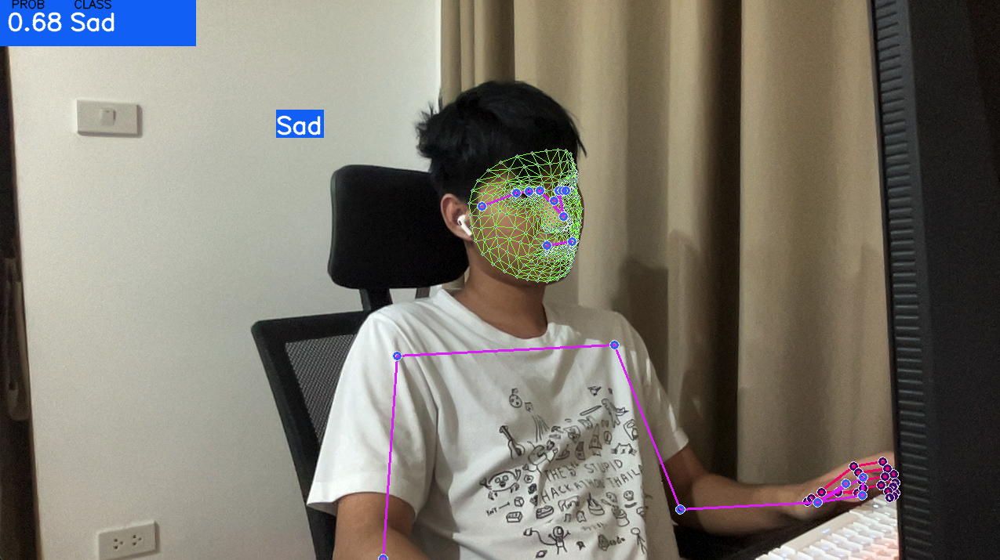

Creating a README for your GitHub project involves explaining the purpose, features, installation, and usage details of your project. Here's an example of how your README.md file might look based on the link you've given:

---

# Realtime Emotion Detection

Realtime Emotion Detection is a project aimed at recognizing and identifying emotions in real-time using advanced machine learning techniques. It takes as input a video stream and identifies emotions in each frame, outputting these emotions for further analysis or action.

## Table of Contents

- [Realtime Emotion Detection](#realtime-emotion-detection)
  - [Table of Contents](#table-of-contents)
  - [Features](#features)
  - [Requirements](#requirements)
  - [Installation](#installation)
  - [Usage](#usage)
  - [Contributing](#contributing)
  - [License](#license)
  - [Examples](#examples)

## Features

- Real-time emotion detection in video streams.
- Uses advanced machine learning techniques for high accuracy.
- Provides a user-friendly interface for easy interaction.

## Requirements

To run Realtime Emotion Detection, you will need:

- Python 3.x
- OpenCV
- Tensorflow 2.x
- Other dependencies listed in `requirements.txt`

## Installation

1. Clone the repo:

   ```
   git clone https://github.com/tententgc/realtime-emotion.git
   ```

2. Change directory:

   ```
   cd realtime-emotion
   ```

3. Install the necessary requirements:

   ```
   pip install -r requirements.txt
   ```

## Usage

To use Realtime Emotion Detection:

```
python main.py
```

This will launch the application which will start processing video input for emotion detection.

## Contributing

If you'd like to contribute to Realtime Emotion Detection, please fork the repository and make changes as you'd like. Pull requests are warmly welcome.

## License

Distributed under the MIT License. See `LICENSE` for more information.

---

Please adjust this according to the actual details of your project. Make sure you clearly explain what your project does, how to install and use it, and any other details a user or contributor might need to know.

## Examples
Here's an example of how Realtime Emotion Detection works:

### Video Example
[](http://www.youtube.com/watch?v=ksNgASS62L8 "Click to watch the video on YouTube!")

### Image Example





